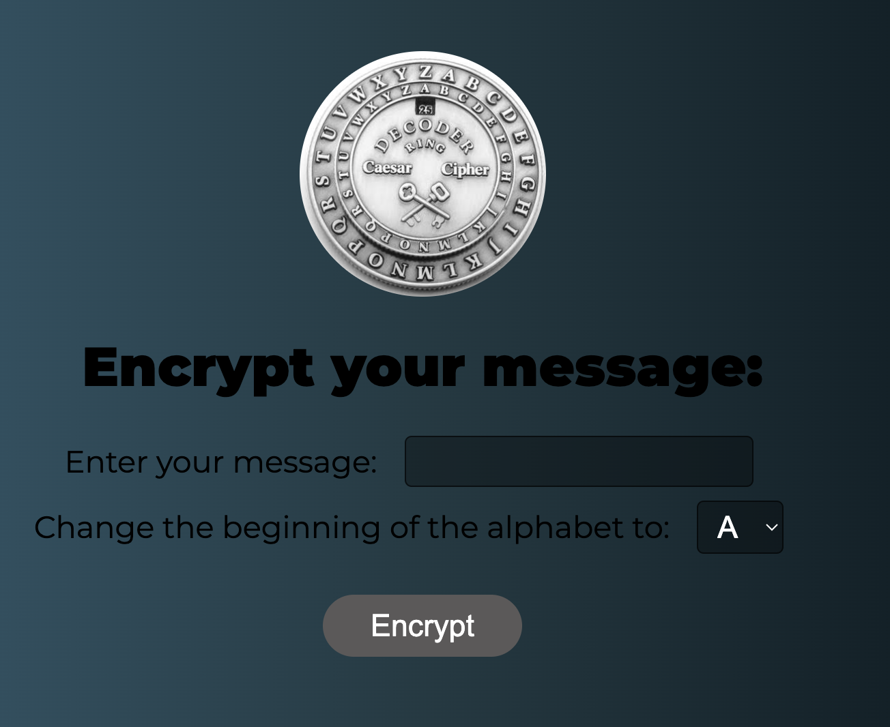

# 🛡️ Caesar Cipher

This project is a simple web application for encrypting messages using the Caesar Cipher. The interface allows users to enter a message and a displacement to shift the letters in the alphabet, generating an encrypted version of the message.

## Live Demo

You can check out the live version of the website here: [Caesar Cipher on Vercel](https://caesar-cipher-silk.vercel.app/).

## 📷 Screenshot




## 📋 Features

- Text input for the message to be encrypted.
- Alphabet displacement selection for the cipher.
- Display of the encrypted text upon clicking a button.

## 📂 Project Structure

- **index.html**: HTML structure of the application.
- **style.css**: Styles for the user interface.
- **script.js**: JavaScript logic for performing the encryption.
- **assets/**: Contains the image used in the header.

## 🚀 Technologies Used

- HTML5
- CSS3
- JavaScript ES6

## 🎨 Visual Style

The application features a dark theme with a gradient background and custom fonts loaded from Google Fonts:

- **Montserrat**
- **Oswald**
- **Roboto**

## 🔧 How to Use

1. Clone the repository to your local machine:
   ```bash
   git clone https://github.com/saleh-coder/caesar-cipher.git
   ```
2. Navigate to the project directory:
   ```bash
   cd caesar-cipher
   ```
3. Open the `index.html` file in your preferred browser.
4. Enter your message, select the desired displacement, and click **Encrypt**.
5. View the encrypted text displayed on the screen.

## 🛠️ Customization

To adjust the project:

- Modify the `style.css` file to change the visual style.
- Update the `script.js` file to add new features or modify the cipher logic.

## 📝 License

This project is licensed under the MIT License. Feel free to use, modify, and distribute it as you wish.

---

Created with ❤️ by Amal(https://github.com/saleh-coder).
